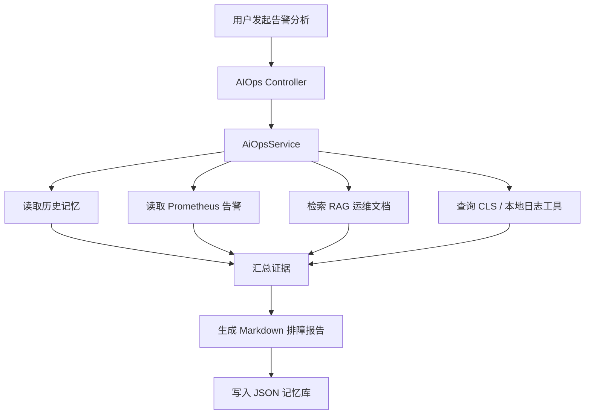

# OnCallPilot Agent 作品集说明

## 项目定位

OnCallPilot 是一个面向企业 OnCall 排障场景的 AIOps Agent 工程项目。它将告警识别、知识库检索、日志查询、历史记忆、根因分析和处置建议生成串成一条可解释链路，用于展示 Agent + RAG + Tool Use 在智能运维场景中的落地能力。

项目适合作为 Agent 工程作品集展示，核心价值不是“堆 Demo”，而是把真实运维排障流程拆成可编排、可取证、可评测、可扩展的 Agent 链路。

## 我做了什么

### 1. Agent 主链路

- 基于 Spring Boot 和 Spring AI Alibaba 搭建统一对话入口。
- 普通问答支持多轮上下文、工具调用和 SSE 流式输出。
- AIOps 场景采用 Planner / Executor / Supervisor 协作模式。
- Planner 负责拆解排查步骤，Executor 负责调用知识库、日志和指标工具取证，Supervisor 负责收敛最终报告。

### 2. RAG 知识库

- 将运维文档切分为 chunk 后写入 Milvus。
- 支持固定窗口、标题层级、语义边界和父子切片等分块策略扩展。
- 支持向量召回、TopK 检索和 rerank。
- 提供 RAG 评测入口，通过 `hit@1`、`hit@k`、`MRR` 观察知识召回效果。

### 3. 日志与工具调用

- Prometheus 告警工具支持 mock 和真实 API 两种模式。
- 日志工具支持本地样例数据和腾讯云 CLS 查询配置。
- MCP 链路采用本地 stdio 方式接入腾讯云 CLS MCP Server。
- 工具参数做了基础校验，降低模型生成无效 region、topic 或查询条件的概率。

### 4. 记忆系统

- 使用 SessionMemory 实现按 `sessionId` 隔离的短期记忆窗口。
- 使用 JSON 文件实现长期故障经验存储。
- AIOps 分析前检索历史经验，分析完成后写入故障摘要、根因、处置建议和证据。
- 后续可平滑升级为数据库存储、向量记忆或关系型事件图谱。

## 技术架构

## 已验证能力

| 能力 | 状态 | 证据 |
| --- | --- | --- |
| Spring Boot 工程编译 | 已验证 | `mvn -q -DskipTests compile` |
| JSON 长期记忆 | 已验证 | `JsonMemoryStoreTest`、`MemoryServiceTest` |
| Session 短期记忆 | 已验证 | `SessionMemoryTest` |
| AIOps 报告生成 | 已验证 | `AiOpsServiceTest` |
| RAG 文档切割 | 已验证 | `DocumentChunkServiceTest` |
| RAG 指标评测入口 | 已实现 | `RagEvalRunner`、`eval/rag-eval.jsonl` |
| 腾讯云 CLS 查询 | 已接入配置 | `QueryLogsTools`、CLS topic 配置 |

## 面试介绍口径

> 我做了一个 OnCallPilot AIOps Agent 项目，核心是把 OnCall 排障流程拆成告警读取、知识检索、日志取证、根因分析和处置建议几个步骤。项目里有 Spring AI Alibaba 的多 Agent 编排、Milvus RAG、腾讯云 CLS 工具调用、Session 短期记忆和 JSON 长期记忆。这个项目能展示我对 Agent 工程链路的理解：不仅能调模型，还能把工具、知识库、评测和记忆系统组合成可运行的业务流程。

## 后续增强方向

1. 补充更多 Prompt before / after 样例，形成系统化调优记录。
2. 增加 Planner-Executor 与单 Agent 的 A/B 对比。
3. 保存完整 AIOps 运行截图或录屏，提升投递材料直观性。
4. 将 JSON 长期记忆升级为数据库或向量记忆，支持更复杂的历史经验检索。
