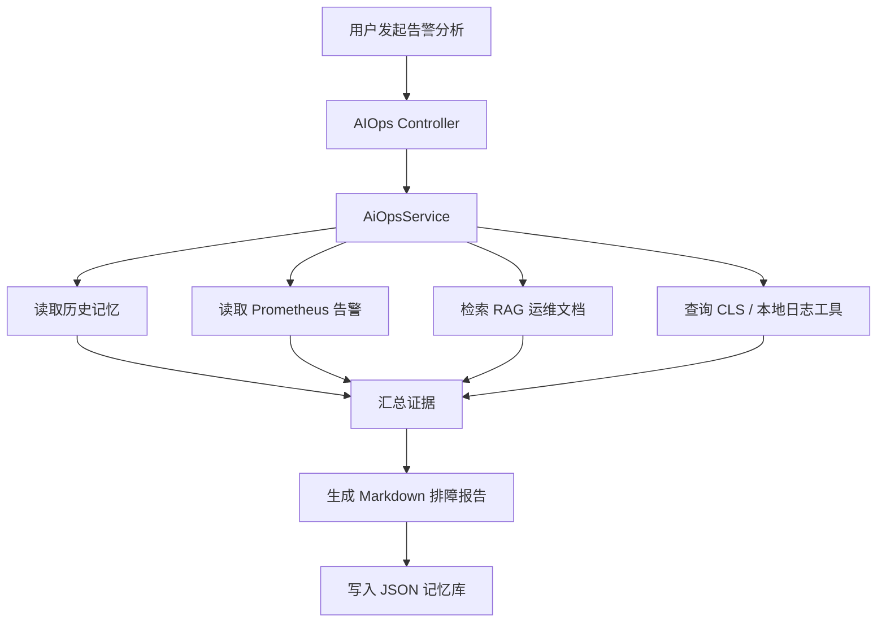

# OnCallPilot 个人作品集说明

## 项目定位

OnCallPilot 是一个面向 OnCall 排障场景的 Agent 工程项目。它把告警读取、知识库检索、日志查询、根因分析和处置建议串成一条可解释链路，用来展示我对 Agent + RAG + Tool Use 的工程落地理解。

这不是生产事故平台，也不声称已经在线上长期运行。当前项目更准确的定位是：

- 可本地运行的 AIOps Agent 原型。
- 使用样例告警、样例日志和腾讯云 CLS 测试主题进行验证。
- 用工程代码和测试材料证明链路设计，而不是用不可复核的线上数据包装结果。

## 我做了什么

### 1. Agent 主链路

- 基于 Spring Boot 和 Spring AI Alibaba 搭建对话入口。
- 在普通问答场景支持多轮上下文、工具调用和 SSE 流式输出。
- 在 AIOps 场景中实现 `planner_agent`、`executor_agent` 和 `supervisor` 的多 Agent 协作。
- 通过 Planner 拆解任务，通过 Executor 调工具取证，再由报告阶段汇总证据。

### 2. RAG 知识库

- 将运维文档切分为 chunk 后写入 Milvus。
- 支持向量召回、TopK 检索和 rerank。
- 补了本地 RAG 评测入口，用 `hit@1`、`hit@k`、`MRR` 观察召回效果。
- 评测结论只代表当前样例集，不等价于生产准确率。

### 3. 日志与工具调用

- Prometheus 告警支持 mock 和真实 API 两种模式。
- 日志工具支持本地样例数据和腾讯云 CLS 查询。
- MCP 链路采用本地 stdio 方式接入腾讯云 CLS MCP Server。
- 工具参数做了基础校验，避免模型随意生成不可用的 region、topic 或查询条件。

### 4. 第一版记忆系统

- 使用 JSON 文件实现长期记忆的第一版存储。
- AIOps 分析前会检索历史故障经验。
- 分析完成后会把故障摘要、根因、处置建议和证据写入记忆库。
- 当前是本地可验证版本，后续可以升级为数据库或向量记忆。

## 技术架构

## 已验证能力

| 能力 | 当前状态 | 证据 |
| --- | --- | --- |
| Spring Boot 工程可编译 | 已验证 | `mvn -q -DskipTests compile` |
| JSON 长期记忆 | 已验证 | `JsonMemoryStoreTest`、`MemoryServiceTest` |
| AIOps 报告生成 | 已验证 | `AiOpsServiceTest` |
| RAG 文档切割 | 已验证 | `DocumentChunkServiceTest` |
| RAG 指标评测入口 | 已实现，需按样例集运行 | `RagEvalRunner`、`eval/rag-eval.jsonl` |
| 腾讯云 CLS 查询 | 已接入测试主题，依赖账号配置 | `QueryLogsTools`、CLS topic 配置 |

## 不夸大的边界

- “分钟级排障”只能作为目标和本地 demo 体验描述，不能说成已在线上稳定达成。
- “85%+ 准确率”如果使用，必须说明是本地样例集的 `hit@k`，不是用户满意度或生产事故根因准确率。
- “真实日志”指的是你自己腾讯云 CLS 测试主题中的日志，不代表企业生产日志。
- 当前还没有系统化的 Agent A/B 对比，也没有长期线上迭代数据。

## 当前不足

1. Prompt 调优记录还不够完整，缺少持续的 before / after 样例。
2. Agent 决策链路缺 A/B 对比，例如 planner 与单 Agent、MCP 与本地工具、rerank 与无 rerank。
3. 作品集还缺截图或录屏，面试官需要更直观看到运行过程。
4. 记忆系统第一版是 JSON 存储，适合展示思路，但还不是生产级存储方案。

## 面试时可以这样介绍

> 我做了一个 AIOps Agent 原型，核心是把 OnCall 排障流程拆成告警读取、知识检索、日志取证、根因分析和处置建议几个步骤。项目里有 Spring AI Alibaba 的 Agent 链路、Milvus RAG、腾讯云 CLS 工具调用和第一版 JSON 长期记忆。当前结果主要来自本地样例集和测试主题验证，我不会把它包装成生产效果。这个项目更能证明的是我亲手做过 Agent 工程链路，并且知道怎么用评测、bad case 和工具约束继续优化它。
