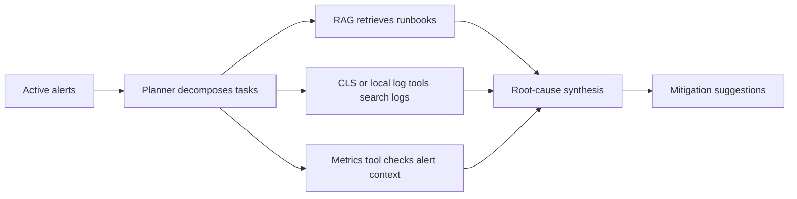

# OnCallPilot Resume Verification Report

This file maps resume statements to concrete project evidence. It is intended for interview preparation and portfolio review.

## Verified Claims

| Resume statement | Current status | Evidence |
| --- | --- | --- |
| Built a Spring Boot + Spring AI Alibaba Agent application | Verified | `mvn -q -DskipTests compile` |
| Implemented a Multi-Agent / ReAct / Plan-Executor AIOps flow | Testable | `AiOpsServiceTest` verifies the generated AIOps report structure and evidence sections |
| Integrated an MCP-style tool chain with Tencent CLS | Configured and testable with credentials | Local stdio MCP configuration and CLS Java SDK integration |
| Implemented CLS / local log retrieval for AIOps evidence collection | Implemented | `QueryLogsTools` supports local sample logs and Tencent CLS topic configuration |
| Implemented SessionId-based conversation isolation | Verified | `SessionMemory` stores history per session key; `ChatController` uses session-level memory maps |
| Implemented context window compression | Verified | `SessionMemoryTest` checks bounded message windows and token-savings calculation |
| Implemented RAG retrieval evaluation | Implemented | `RagEvalRunner` reports `hit@1`, `hit@k`, and `MRR` on the configured eval dataset |
| Implemented JSON long-term Agent memory | Verified | `JsonMemoryStoreTest`, `MemoryServiceTest`, and `AiOpsServiceTest` verify read/write/search integration |

## Commands

Run the resume evidence check:

```powershell
powershell -ExecutionPolicy Bypass -File scripts/verify-resume-claims.ps1
```

Run the context-compression test:

```powershell
mvn -q -Dtest=SessionMemoryTest test
```

Run compile verification:

```powershell
mvn -q -DskipTests compile
```

## AIOps Evidence Summary

The local verification setup uses:

- Spring Boot local profile.
- Local stdio MCP for Tencent CLS.
- Tencent CLS topics when credentials are configured.
- Prometheus mock alerts for current active alert input.
- Sample or CLS topic log evidence for CPU, application and database symptoms.

The generated report follows this chain:



## Recommended Resume Wording

> Built OnCallPilot, an AIOps Agent project based on Spring Boot and Spring AI Alibaba. The system uses a Planner-Executor style Agent flow to connect alert reading, RAG runbook retrieval, CLS/local log search, root-cause synthesis and remediation suggestion generation. I also implemented SessionId-based short-term memory, JSON long-term incident memory, and a RAG retrieval evaluation pipeline with hit@1, hit@K and MRR metrics.

## Evidence To Keep Updating

- Add more Prompt before / after tuning records.
- Save AIOps running screenshots or short recordings.
- Add A/B reports for Planner-Executor vs single Agent and rerank vs no rerank.
