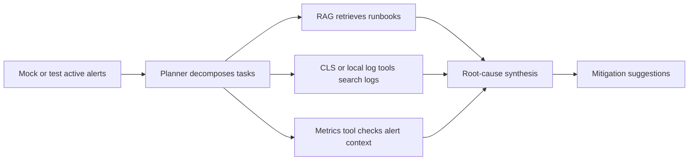

# OnCallPilot Resume Verification Report

This file maps resume claims to concrete project evidence. It is intended for interview preparation and portfolio review.

Important boundary: these checks are local or test-topic evidence. They should not be presented as production SLOs, production incident accuracy, or long-running online results.

## Verified Claims

| Resume claim | Current status | Evidence |
| --- | --- | --- |
| Spring Boot + Spring AI Alibaba application | Verified | `mvn -q -DskipTests compile` passes |
| Multi-Agent / ReAct / Plan-Executor AIOps flow | Locally testable | `AiOpsServiceTest` verifies the generated AIOps report structure and evidence sections |
| MCP tool chain with Tencent CLS | Locally testable, account-dependent | Local stdio MCP configuration exists; full verification requires valid Tencent Cloud credentials and CLS topics |
| CLS log retrieval | Test-topic only | The project can query Tencent CLS test topics or local sample logs; do not describe this as enterprise production log access |
| SessionId-based session isolation | Implemented and testable | `SessionMemory` stores history per session key; `ChatController` uses `Map<String, SessionMemory>` |
| Context window compression | Implemented and testable | `SessionMemoryTest` checks bounded message windows and token-savings calculation on synthetic messages |
| RAG retrieval evaluation | Implemented, dataset-scoped | `RagEvalRunner` reports `hit@1`, `hit@k`, and `MRR` on the configured local eval dataset |
| JSON long-term memory | Implemented and testable | `JsonMemoryStoreTest`, `MemoryServiceTest`, and `AiOpsServiceTest` verify read/write/search integration |

## Commands

Run the resume evidence check:

```powershell
powershell -ExecutionPolicy Bypass -File scripts/verify-resume-claims.ps1
```

Run the context-compression test:

```powershell
mvn -q -Dtest=SessionMemoryTest test
```

Run compile verification:

```powershell
mvn -q -DskipTests compile
```

## AIOps Evidence Summary

The intended local verification setup uses:

- Spring Boot local profile.
- Local stdio MCP for Tencent CLS.
- Tencent CLS test topics, when credentials are configured.
- Prometheus mock alerts for current active alert input.
- Sample or test-topic log evidence for CPU and database pool symptoms.

The generated report is expected to show this chain:



## Notes On Metrics

The current RAG metric verifies whether the retrieval chain returns the expected runbook source or expected content in TopK. It does not grade final answer quality, operator satisfaction, or production root-cause accuracy.

Safe resume wording:

> Built a RAG retrieval evaluation pipeline with hit@1, hit@K, and MRR metrics on a local AIOps runbook dataset.

Avoid wording like:

> Production root-cause accuracy reached 85%+.

That claim is not supported by the current project evidence.
